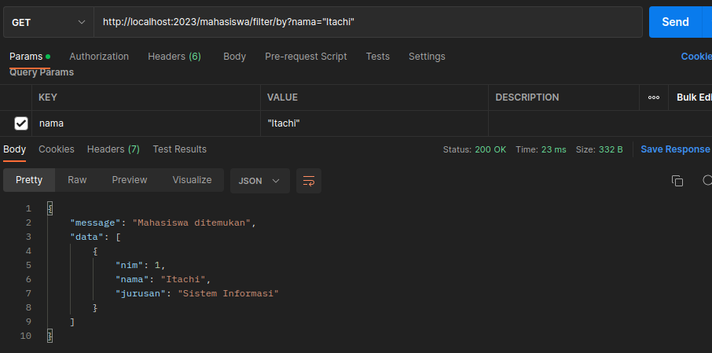

# Pokok Bahasan:

- [Routing](https://github.com/argianardi/expressJS-doc/tree/main/routing)
- [Middleware](https://github.com/argianardi/expressJS-doc/tree/main/middleware)
- [Error Handling](https://github.com/argianardi/expressJS-doc/tree/main/error_handling)
- [File Request](https://github.com/argianardi/expressJS-doc/tree/main/file_request)

## Persiapan Project

Terdapat beberapa hal yang harus kita siapkan sebelum membuat project [[1]](https://www.youtube.com/watch?v=CNOrmjmK-eM&list=PLwdv9eOjH5CZrEPvWIzJqdaPfeCny9urc&index=2):

- Buat file utama project bisa dinamai dengan app.js atau index.js
- Arahkan fokus teminal ke directory project, kemudian command `npm init` dan isi beberapa pertanya yang diajukan:

  - package name
  - version
  - description
  - entry point (file utama)
  - git repository (bisa dikosongkan dulu)
  - keywords
  - author
  - license (bisa diisi dengan ISC)
  - kemudain command ok sehingga nanti akan muncul file package.json

- Install expressJS dengan command `npm install --save express`

- Buat file server.js untuk menghandle server yang akan digunakan untuk project kita <br>
  Pada file server buat blok code berikut [[3]](https://github.com/argianardi/SinauExpressJS/blob/projectCRUD/server.js):

  ```
  const http = require("http");
  const app = require("./index");

  const port = process.env.PORT || 2023;

  const server = http.createServer(app);
  server.listen(port);
  ```

  `index` adalah file utama di project ini, berisi blok code untuk menginisialisasi express:

  ```
  const express = require("express");
  const app = express();

  app.use((req, res, next) => {
    res.status(200).json({
        message: `Restfull nodejs dan express`,
    });
  });

  module.exports = app;
  ```

- Jalankan file server.js menggunakan node js dengan command `nodemon server.js` <br>
  Setelah itu coba kita jalankan `http://localhost:2023/` di browser hasilnya akan menghasilkan response:
  ```
  {
    "message":"Restfull nodejs dan express"
  }
  ```

## Membuat Routes

Terdapat beberapa langkah yang harus dijalankan dalam membuat routing [[1]](https://www.youtube.com/watch?v=qRXOQ-ahoLA&list=PLwdv9eOjH5CZrEPvWIzJqdaPfeCny9urc&index=3):

- Buat folder routes untuk menampung semua file yang berkaitan dengan route
- Di dalam folder routes buat file mahasiswa.js <br>
  Pada file ini buat inisialisasi express js dan express route, kemudian buat dan export fungsi routing:

  ```
  const express = require("express");
  const router = express.Router();

  router.get("/", (req, res, next) => {
      res.status(200).json({
          message: "get method mahasiswa",
      });
  });

  router.post("/", (req, res, next) => {
      res.status(200).json({
          message: "post method mahasiswa",
      });
  });

  router.get("/:nim", (req, res, next) => {
    const nim = req.params.nim;
    if (nim === "12345") {
        res.status(200).json({
        message: "NIM 12345",
        });
    } else {
        res.status(200).json({
        message: "NIM Lain",
        });
    }
  });

  module.exports = router;
  ```

- Pada file utama (index) buat function routing untuk mahasiswa dengan menggunakan function routing dari file `mahasiswa.js` yang diimport menggunakan `require`:

  ```
  const express = require("express");
  const app = express();
  //------------------------------------------------
  const mahasiswaRoutes = require("./routes/mahasiswa");

  app.use('/mahasiswa', mahasiswaRoutes)
  //------------------------------------------------

  module.exports = app;
  ```

- Hasilnya saat di postman jika kita mencoba request get dengan url `http://localhost:2023/mahasiswa` akan menghasilkan status 200 dan body response:

  ```
  {
    "message": "get method mahasiswa"
  }
  ```

  Begitu juga jika kita melakukan request post menggunakan url `http://localhost:2023/mahasiswa` akan menghasilkan status 200 dan body response:

  ```
  {
      "message": "post method mahasiswa"
  }
  ```

  Jika kita melakukan request get dengan url `http://localhost:2023/mahasiswa/12345` akan menghasilkan status 200 dan body response:

  ```
  {
  "message": "NIM 12345"
  }
  ```

  Tetapi jika kita melakukan request get menggunakan url dengan nim selain 12345 maka akan menghasilkan status 200 dan body response:

  ```
  {
  "message": "NIM Lain"
  }
  ```

## Body Parser

Body parser adalah library yang berisi middleware untuk membaca sebuah data yang dikirimkan oleh http post dan menyimpannya sebagai object javascript yang dapat diakses melalui req.body [[2]](https://santrikoding.com/tutorial-expressjs-restful-api-4-insert-data-ke-database). Berikut cara penggunaannya [[1]](https://www.youtube.com/watch?v=sjRtGR8tQDI&list=PLwdv9eOjH5CZrEPvWIzJqdaPfeCny9urc&index=4):

- Install body parser dengan command:

  ```
  npm install --save body-parser
  ```

- Inisiasi body parser di file utama project (di contoh index.js)

  ```
  const express = require("express");
  const app = express();
  //-----------------------------------------------------
  const bodyParser = require("body-parser");

  const mahasiswaRoutes = require("./routes/mahasiswa");

  app.use(bodyParser.urlencoded({ extended: false }));
  app.use(bodyParser.json());
  //-----------------------------------------------------
  app.use("/mahasiswa", mahasiswaRoutes);

  module.exports = app;
  ```

- Buat `req.body` di routing function dengan method post (di contoh di bagian file mahasiswa.js)

  ```
  const express = require("express");
  const router = express.Router();

  router.get("/", (req, res, next) => {
      res.status(200).json({
          message: "get method mahasiswa",
      });
  });

  router.post("/", (req, res, next) => {
    //---------------------------------------------------
      const mahasiswa = {
          nim: req.body.nim,
          nama: req.body.nama,
      };
    //---------------------------------------------------
      res.status(200).json({
          message: "post method mahasiswa",
          data: mahasiswa,
      });
  });

  router.get("/:nim", (req, res, next) => {
      const nim = req.params.nim;
      if (nim === "12345") {
          res.status(200).json({
          message: "NIM 12345",
          });
      } else {
          res.status(200).json({
          message: "NIM Lain",
          });
      }
  });

  module.exports = router;
  ```

  Maka jika kita melakukan request post menggunakan url `http://localhost:2023/mahasiswa` dan membuat body request berikut:

  ```
  {
      "nim": "12345",
      "nama": "Uchiha Itachi "
  }
  ```

  Akan menghasilkan status 200 dan body response:

  ```
  {
      "message": "post method mahasiswa",
      "data": {
          "nim": "12345",
          "nama": "Uchiha Itachi "
      }
  }
  ```

## Error Handling

Digunakan untuk memberikan keterangan error saat request yang dilakukan user terjadi kesalahan. Untuk melakukannya langsung tambahkan function error handling di tempat yang kita inginkan (di contoh di bagian file utama project yaitu index.js)

```
const express = require("express");
const app = express();
const bodyParser = require("body-parser");

const mahasiswaRoutes = require("./routes/mahasiswa");

app.use(bodyParser.urlencoded({ extended: false }));
app.use(bodyParser.json());
app.use("/mahasiswa", mahasiswaRoutes);

//--------------------------------------------------
app.use((req, res, next) => {
    const error = new Error("Tidak ditemukan");
    error.status = 404;
    next(error);
});

app.use((error, req, res, next) => {
    res.status(error.status || 500);
    res.json({
        error: error.message,
    });
});
//--------------------------------------------------
module.exports = app;
```

Dengan adanya function error handling di atas semua routes (user melakukan request dengan alamat url yang salah) yang belum terdefinisikan akan diarahkan ke function error handling tersebut [[1]](https://www.youtube.com/watch?v=9LEAyHG7GqI&list=PLwdv9eOjH5CZrEPvWIzJqdaPfeCny9urc&index=5) . Maka saat kita melakukan request dengan method apapun dan alamat url yang salah akan menghasilkan response status 404 dan body response:

```
{
    "error": "Tidak ditemukan"
}
```

## Connect To MYSQL

Berikut langkah - langkah untuk melakukan koneksi ke mysql [[1]](https://www.youtube.com/watch?v=zd2WAqAP7pg&list=PLwdv9eOjH5CZrEPvWIzJqdaPfeCny9urc&index=6):

- Buat data base, table dan insert data di mysql <br>
  Di contoh ini kita membuat data base bernama kuliah dan table bernama mahasiswa.
- install mysql, dengan command:

  ```
  npm install --save mysql
  ```

- Buat folder bernama config, di dalamnya buat file bernama mysql.js dan buat code berikut:

  ```
  var mysql = require("mysql");

  var con = mysql.createConnection({
    host: "localhost",
    user: "root",
    password: "zero",
    database: "kuliah",
  });

  con.connect(function (error) {
    if (error) throw error;
    console.log("Koneksi berhasil");
  });

  module.exports = con;
  ```

- Running file mysql.js menggunakan nodemon dengan command `nodemon mysql.js` <br>
  Setelah dirunning akan di log akan tampil `Koneksi berhasil` sebagai tanda bahwa kita telah berhasil melakukan koneksi ke mysql.

## GET Database MYSQL

Untuk bisa melakukan request get data dari database mysql, lakukan langkah - langkah berikut [[1]](https://www.youtube.com/watch?v=Y3Pi3LoxC34&list=PLwdv9eOjH5CZrEPvWIzJqdaPfeCny9urc&index=7):

- import database yang akan kita gunakan (di contoh di file mysql.js di dalam folder config) di file routes tempat kita akan melakukan reques get (di contoh di file mahasiswa.js di dalam folder routes)

  ```
  const express = require("express");
  const router = express.Router();
  //-------------------------------------------------------
  const db = require("../config/mysql");
  //-------------------------------------------------------

  router.get("/", (req, res, next) => {
    res.status(200).json({
      message: "get method mahasiswa",
    });
  });

  router.post("/", (req, res, next) => {
    const mahasiswa = {
      nim: req.body.nim,
      nama: req.body.nama,
    };
    res.status(200).json({
      message: "post method mahasiswa",
      data: mahasiswa,
    });
  });

  router.get("/:nim", (req, res, next) => {
    const nim = req.params.nim;
    if (nim === "12345") {
      res.status(200).json({
        message: "NIM 12345",
      });
    } else {
      res.status(200).json({
        message: "NIM Lain",
      });
    }
  });

  module.exports = router;
  ```

- Buat query mysql dan responsenya di dalam routing function dengan request get [[3]](https://github.com/argianardi/SinauExpressJS/blob/getDataBaseMYSQL/routes/mahasiswa.js).

  ```
  const express = require("express");
  const router = express.Router();
  const db = require("../config/mysql");

  //----------------------------------------------------------
  router.get("/", (req, res, next) => {
    var sql = "SELECT * FROM mahasiswa";
    db.query(sql, (err, result) => {
      if (err) throw err;
      res.status(200).json({
        message: "get method mahasiswa",
        data: result,
      });
    });
  });
  //----------------------------------------------------------

  router.post("/", (req, res, next) => {
    const mahasiswa = {
      nim: req.body.nim,
      nama: req.body.nama,
    };
    res.status(200).json({
      message: "post method mahasiswa",
      data: mahasiswa,
    });
  });

  router.get("/:nim", (req, res, next) => {
    const nim = req.params.nim;
    if (nim === "12345") {
      res.status(200).json({
        message: "NIM 12345",
      });
    } else {
      res.status(200).json({
        message: "NIM Lain",
      });
    }
  });

  module.exports = router;
  ```

  Sehingga jika kita melakukan request get menggunakan url `http://localhost:2023/mahasiswa` di postman akan menghasilkan status 200 dan body response sesuai dengan data yang telah kita insert di table dalam data base yang kita buat sebelumnya (di contoh menggunakan table mahasiswa dan databases mahasiswa) seperti ini:

  ```
  {
      "message": "get method mahasiswa",
      "data": [
          {
              "nim": 1,
              "nama": "Itachi",
              "jurusan": "Sistem Informasi"
          },
          {
              "nim": 2,
              "nama": "Hidan",
              "jurusan": "Sistem Informasi"
          }
      ]
  }
  ```

  Kita juga bisa melakukan setting get request untuk mendapatkan data satu mahasiswa berdasarkan nimnya [[3]](https://github.com/argianardi/SinauExpressJS/blob/getDataBaseMYSQL/routes/mahasiswa.js):

  ```
  const express = require("express");
  const router = express.Router();
  const db = require("../config/mysql");

  router.get("/", (req, res, next) => {
    var sql = "SELECT * FROM mahasiswa";
    db.query(sql, (err, result) => {
      if (err) throw err;
      res.status(200).json({
        message: "get method mahasiswa",
        data: result,
      });
    });
  });

  router.post("/", (req, res, next) => {
    const mahasiswa = {
      nim: req.body.nim,
      nama: req.body.nama,
    };
    res.status(200).json({
      message: "post method mahasiswa",
      data: mahasiswa,
    });
  });

  //----------------------------------------------------------------
  router.get("/:nim", (req, res, next) => {
    const nim = req.params.nim;
    var sql = `SELECT * FROM mahasiswa WHERE nim = ${nim}`;
    db.query(sql, (err, result) => {
      if (err) throw err;
      res.status(200).json({
        message: "Mahasiswa ditemukan",
        data: result,
      });
    });
  });
  //----------------------------------------------------------------

  module.exports = router;
  ```

  Hasilnya jika kita melakukan reques get dengan url `http://localhost:2023/mahasiswa/1` akan menghasilkan status 200 dan response body data mahasiswa yang memiliki nim 1, yang sebelumnya sudah kita insert datanya di table mahasiswa dalam database kuliah:

  ```
  {
      "message": "Mahasiswa ditemukan",
      "data": [
          {
              "nim": 1,
              "nama": "Itachi",
              "jurusan": "Sistem Informasi"
          }
      ]
  }
  ```

## CRUD MYSQL

### Create

Untuk `create` ini bisa dilakukan menggunakan request post [[3]](https://github.com/argianardi/SinauExpressJS/blob/CRUDmysql/routes/mahasiswa.js).

```
const express = require("express");
const router = express.Router();
const db = require("../config/mysql");

router.get("/", (req, res, next) => {
  var sql = "SELECT * FROM mahasiswa";
  db.query(sql, (err, result) => {
    if (err) throw err;
    res.status(200).json({
      message: "get method mahasiswa",
      data: result,
    });
  });
});

//-------------------------------------------------------------------------------------
router.post("/", (req, res, next) => {
  const nama = req.body.nama;
  const jurusan = req.body.jurusan;
  var sql =
    "INSERT INTO mahasiswa (nama, jurusan) values ('" + nama + "', '" + jurusan + "')";
  db.query(sql, (err, result) => {
    if (err) throw err;
    res.status(200).json({
      message: "Data mahasiswa berhasil ditambahkan",
    });
  });
});
//-------------------------------------------------------------------------------------

router.get("/:nim", (req, res, next) => {
  const nim = req.params.nim;
  var sql = `SELECT * FROM mahasiswa WHERE nim = ${nim}`;
  db.query(sql, (err, result) => {
    if (err) throw err;
    res.status(200).json({
      message: "Mahasiswa ditemukan",
      data: result,
    });
  });
});

module.exports = router;
```

Hasilnya jika kita melakukan request post di postman menggunakan url `http://localhost:2023/mahasiswa` menggunakan body request:

```
{
    "nama": "Deidara",
    "jurusan": "Sistem Informasi"
}
```

Akan menghasilkan response 200 dan body response:

```
{
    "message": "Data mahasiswa berhasil ditambahkan"
}
```

Dan data baru yang kita post tersebut bisa kita check dengan menggunakan request get menggunakan url `http://localhost:2023/mahasiswa` akan menghasilkan response status 200 dan body response:

```
{
    "message": "get method mahasiswa",
    "data": [
        {
            "nim": 1,
            "nama": "Itachi",
            "jurusan": "Sistem Informasi"
        },
        {
            "nim": 2,
            "nama": "Hidan",
            "jurusan": "Sistem Informasi"
        },
        {
            "nim": 3,
            "nama": "Deidara",
            "jurusan": "Sistem Informasi"
        }
    ]
}
```

### Update

Untuk Update data bisa dilakukan menggunakan request put. Pada request put ini membutuhkan body request yang nantinya digunakan untuk merubah data yang diinginkan, ini contohnya [[3]](https://github.com/argianardi/SinauExpressJS/blob/CRUDmysql/routes/mahasiswa.js):

```
const express = require("express");
const router = express.Router();
const db = require("../config/mysql");

router.get("/", (req, res, next) => {
  var sql = "SELECT * FROM mahasiswa";
  db.query(sql, (err, result) => {
    if (err) throw err;
    res.status(200).json({
      message: "get method mahasiswa",
      data: result,
    });
  });
});

router.post("/", (req, res, next) => {
  const nama = req.body.nama;
  const jurusan = req.body.jurusan;
  var sql =
    "INSERT INTO mahasiswa (nama, jurusan) values ('" +
    nama +
    "', '" +
    jurusan +
    "')";
  db.query(sql, (err, result) => {
    if (err) throw err;
    res.status(200).json({
      message: "Data mahasiswa berhasil ditambahkan",
    });
  });
});

router.get("/:nim", (req, res, next) => {
  const nim = req.params.nim;
  var sql = `SELECT * FROM mahasiswa WHERE nim = ${nim}`;
  db.query(sql, (err, result) => {
    if (err) throw err;
    res.status(200).json({
      message: "Mahasiswa ditemukan",
      data: result,
    });
  });
});

//-------------------------------------------------------------------------------------------------------------
router.put("/:nim", (req, res, next) => {
  const nim = req.params.nim;
  const nama = req.body.nama;
  const jurusan = req.body.jurusan;
  let sql =
    "UPDATE mahasiswa SET nama = '" + nama + "', jurusan = '" + jurusan + "' WHERE nim = " + nim;

  db.query(sql, (err, result) => {
    if (err) throw err;
    res.status(200).json({
      message: "Data mahasiswa berhasil diupdate",
    });
  });
});
//-------------------------------------------------------------------------------------------------------------

module.exports = router;
```

Misalnya kita ingin mengubah data untuk mahasiswa yang nimnya 2, ini dilakukan menggunakan request put dan url `http://localhost:2023/mahasiswa/2` serta body request:

```
{
    "nama": "Kisame",
    "jurusan": "Sistem Informasi"
}
```

Maka akan menghasilkan response status 200 dan body response:

```
{
    "message": "Data mahasiswa berhasil diupdate"
}
```

Untuk melihat hasil data yang diupdate dapat dilihat menggunakan request get mahasiswa dan url berdasarkan nimnya, misalnya kita tadi mengupdate data mahasiswa yang nimnya 2 makan gunakan request get menggunakan url `http://localhost:2023/mahasiswa/2` hasilnya akan terlihat seperti ini:

```
{
    "message": "Mahasiswa ditemukan",
    "data": [
        {
            "nim": 2,
            "nama": "Kisame",
            "jurusan": "Sistem Informasi"
        }
    ]
}
```

Terlihat terjadi perubahan data di bagian namanya, yang sebelumnya seperti ini:

```
{
    "message": "Mahasiswa ditemukan",
    "data": [
        {
            "nim": 2,
            "nama": "Hidan",
            "jurusan": "Sistem Informasi"
        }
    ]
}
```

### Delete

Untuk menghapus data mahasiswa kita dapat melakukannya menggunakan request Delete. Pada method delete ini membutuhkan url yang spesifik / unique untuk mereference data yang dihapus biasanya menggunakan id, dicontoh ini menggunakan nim [[3]](https://github.com/argianardi/SinauExpressJS/blob/CRUDmysql/routes/mahasiswa.js):

```
const express = require("express");
const router = express.Router();
const db = require("../config/mysql");

router.get("/", (req, res, next) => {
  var sql = "SELECT * FROM mahasiswa";
  db.query(sql, (err, result) => {
    if (err) throw err;
    res.status(200).json({
      message: "get method mahasiswa",
      data: result,
    });
  });
});

router.post("/", (req, res, next) => {
  const nama = req.body.nama;
  const jurusan = req.body.jurusan;
  var sql =
    "INSERT INTO mahasiswa (nama, jurusan) values ('" +
    nama +
    "', '" +
    jurusan +
    "')";
  db.query(sql, (err, result) => {
    if (err) throw err;
    res.status(200).json({
      message: "Data mahasiswa berhasil ditambahkan",
    });
  });
});

router.get("/:nim", (req, res, next) => {
  const nim = req.params.nim;
  var sql = `SELECT * FROM mahasiswa WHERE nim = ${nim}`;
  db.query(sql, (err, result) => {
    if (err) throw err;
    res.status(200).json({
      message: "Mahasiswa ditemukan",
      data: result,
    });
  });
});

router.put("/:nim", (req, res, next) => {
  const nim = req.params.nim;
  const nama = req.body.nama;
  const jurusan = req.body.jurusan;
  let sql =
    "UPDATE mahasiswa SET nama = '" +
    nama +
    "', jurusan = '" +
    jurusan +
    "' WHERE nim = " +
    nim;

  db.query(sql, (err, result) => {
    if (err) throw err;
    res.status(200).json({
      message: "Data mahasiswa berhasil diupdate",
    });
  });
});

//-----------------------------------------------------------------
router.delete("/:nim", (req, res, next) => {
  const nim = req.params.nim;
  let sql = `DELETE FROM mahasiswa WHERE nim = ${nim}`;

  db.query(sql, (err, result) => {
    if (err) throw err;
    res.status(200).json({
      message: "Data mahasiswa berhasil dihapus",
    });
  });
});
//-----------------------------------------------------------------

module.exports = router;
```

Misalnya kita ingin menghapus data mahasiswa yang nimnya 3, dapat dilakukan dengan request delete dan url `http://localhost:2023/mahasiswa/3`. Hasilnya akan tampil respon status 200 dan body response:

```
{
    "message": "Data mahasiswa berhasil dihapus"
}
```

Untuk melihat hasilnya kita bisa melakukan request get semua data mahasiswa dengan url `http://localhost:2023/mahasiswa`. Hasilnya akan tampil respon status 200 dan body response:

```
{
    "message": "get method mahasiswa",
    "data": [
        {
            "nim": 1,
            "nama": "Itachi",
            "jurusan": "Sistem Informasi"
        },
        {
            "nim": 2,
            "nama": "Kisame",
            "jurusan": "Sistem Informasi"
        }
    ]
}
```

Terlihat data mahasiswa dengan nim 3 sudah terhapus.

## Request Parameters, Request query dan Request Body

### Request Parameters (req.params)

req.params adalah cara yang biasa digunakan untuk menangkap value yang dikirim ke url atau path [[4]](https://himasis.org/artikel/242-materi-membuat-restful-api-dengan-express-js-bagian-3-komunikasi-server). Properti ini berisi objek yang dikirimkan / dipetakkan ke “parameters” dalam path route function. Seperti pada contoh ini kita gunakan nim sebagai req.params [[3]](https://github.com/argianardi/SinauExpressJS/blob/reqQueryParamBody/routes/mahasiswa.js).

```
const express = require("express");
const router = express.Router();
const db = require("../config/mysql");

router.get("/", (req, res, next) => {
  var sql = "SELECT * FROM mahasiswa";
  db.query(sql, (err, result) => {
    if (err) throw err;
    res.status(200).json({
      message: "get method mahasiswa",
      data: result,
    });
  });
});

router.post("/", (req, res, next) => {
  const nama = req.body.nama;
  const jurusan = req.body.jurusan;
  var sql =
    "INSERT INTO mahasiswa (nama, jurusan) values ('" + nama + "', '" + jurusan + "')";
  db.query(sql, (err, result) => {
    if (err) throw err;
    res.status(200).json({
      message: "Data mahasiswa berhasil ditambahkan",
    });
  });
});

//--------------------------------------------------------------
router.get("/:nim", (req, res, next) => {
  const nim = req.params.nim;
  var sql = `SELECT * FROM mahasiswa WHERE nim = ${nim}`;
  db.query(sql, (err, result) => {
    if (err) throw err;
    res.status(200).json({
      message: "Mahasiswa ditemukan",
      data: result,
    });
  });
});
//--------------------------------------------------------------

//--------------------------------------------------------------
router.put("/:nim", (req, res, next) => {
  const nim = req.params.nim;
  const nama = req.body.nama;
  const jurusan = req.body.jurusan;
  let sql = "UPDATE mahasiswa SET nama = '" + nama + "', jurusan = '" + jurusan + "' WHERE nim = " + nim;

  db.query(sql, (err, result) => {
    if (err) throw err;
    res.status(200).json({
      message: "Data mahasiswa berhasil diupdate",
    });
  });
});
//--------------------------------------------------------------

//--------------------------------------------------------------
router.delete("/:nim", (req, res, next) => {
  const nim = req.params.nim;
  let sql = `DELETE FROM mahasiswa WHERE nim = ${nim}`;

  db.query(sql, (err, result) => {
    if (err) throw err;
    res.status(200).json({
      message: "Data mahasiswa berhasil dihapus",
    });
  });
});
//--------------------------------------------------------------

module.exports = router;
```

Sehingga dengan adanya req.params ini kita bisa mendapatkan, mengupdate dan menghapus data mahasiswa berdasarkan nimnya. Misalnya kita ingin mendapatkan data mahasiswa yang nimnya 1 bisa dilakukan dengan get request menggunakan url `server/mahasiswa/1`, hasilnya kita akan mendapatkan body response data mahasiswa yang nimnya 1 seperti ini:

```
{
    "message": "Mahasiswa ditemukan",
    "data": [
        {
            "nim": 1,
            "nama": "Itachi",
            "jurusan": "Sistem Informasi"
        }
    ]
}
```

Properti “nim” tersebut disebut sebagai parameters. Untuk dapat menggunakan nya maka menggunakan kode req.params.nim. req.params ini biasanya digunakan untuk mendapat data detail berdasarkan id, updating data (method put),dan hapus data (method delete) pada database [[4]](https://himasis.org/artikel/242-materi-membuat-restful-api-dengan-express-js-bagian-3-komunikasi-server).

### Request Query (req.query)

req.query adalah cara untuk mengirimkan data atau value melalui URL dengan menggunakan key/query string tertentu. Properti ini adalah objek yang berisi parameter string query pada route. Jika tidak ada query string yang dikirimkan maka akan didapati objek kosong {}. Req.query diawali dengan tanda “?” dan dinamai sesuai dengan variable yang dibutuhkan [[4]](https://himasis.org/artikel/242-materi-membuat-restful-api-dengan-express-js-bagian-3-komunikasi-server). Misalnya kita ingin menjadikan nama mahasiswa sebagai query, berikut contoh penggunaannya [[3]](https://github.com/argianardi/SinauExpressJS/blob/reqQueryParamBody/routes/mahasiswa.js):

```
const express = require("express");
const router = express.Router();
const db = require("../config/mysql");

router.get("/", (req, res, next) => {
  var sql = "SELECT * FROM mahasiswa";
  db.query(sql, (err, result) => {
    if (err) throw err;
    res.status(200).json({
      message: "get method mahasiswa",
      data: result,
    });
  });
});

router.post("/", (req, res, next) => {
  const nama = req.body.nama;
  const jurusan = req.body.jurusan;
  var sql = "INSERT INTO mahasiswa (nama, jurusan)  values ('" + nama + "', '" + jurusan + "')";
  db.query(sql, (err, result) => {
    if (err) throw err;
    res.status(200).json({
      message: "Data mahasiswa berhasil ditambahkan",
    });
  });
});

router.get("/:nim", (req, res, next) => {
  const nim = req.params.nim;
  var sql = `SELECT * FROM mahasiswa WHERE nim = ${nim}`;
  db.query(sql, (err, result) => {
    if (err) throw err;
    res.status(200).json({
      message: "Mahasiswa ditemukan",
      data: result,
    });
  });
});

router.put("/:nim", (req, res, next) => {
  const nim = req.params.nim;
  const nama = req.body.nama;
  const jurusan = req.body.jurusan;
  let sql =
    "UPDATE mahasiswa SET nama = '" + nama + "',  = '" + jurusan + "' WHERE nim = " + nim;

  db.query(sql, (err, result) => {
    if (err) throw err;
    res.status(200).json({
      message: "Data mahasiswa berhasil diupdate",
    });
  });
});

router.delete("/:nim", (req, res, next) => {
  const nim = req.params.nim;
  let sql = `DELETE FROM mahasiswa WHERE nim = ${nim}`;

  db.query(sql, (err, result) => {
    if (err) throw err;
    res.status(200).json({
      message: "Data mahasiswa berhasil dihapus",
    });
  });
});

//-------------------------------------------------------------
router.get("/filter/by", (req, res, next) => {
  const nama = req.query.nama;
  var sql = `SELECT * FROM mahasiswa WHERE nama= ${nama}`;
  db.query(sql, (err, result) => {
    if (err) throw err;
    if (result.length > 0) {
      res.status(200).json({
        message: "Data mahasiswa ditemukan",
        data: result,
      });
    } else {
      res.status(200).json({
        message: "Data mahasiswa tidak ditemukan",
        data: result,
      });
    }
  });
});
//-------------------------------------------------------------

module.exports = router;
```

Untuk penggunaannya kita bisa melakukan request get di postman menggunakan url `http://localhost:2023/mahasiswa/filter/by` kemudian tambahkan nama sebagai query dibagian Query Params seperti ini:

<p align='center'>

</p>

req.query ini biasanya digunakan untuk fitur filter data yang terdapat pada database. Dan jika kita menggunakan value querry(nama) yang tidak ada di dalam data base hasilnya akan seperti ini:

```
{
    "message": "Data mahasiswa tidak ditemukan",
    "data": []
}
```

### Request Body (req.body)

req.body berfungsi untuk menangkap nilai yang dikirimkan melalui form-html (interface). untuk menggunakan req.body sendiri kita harus memanggil library body-parser. body-parser adalah library untuk menangani application/x-www-form-urlencoded (data json yang dikirim melalui form-html/interface) [[5]](https://medium.com/@musliadi/apa-perbedaan-req-body-req-params-req-query-pada-nodejs-eb3450914447). Kita juga telah menggunakan req.body di contoh sebelumnya tepatnya di bagian request post di dalam file mahasiswa.js [[3]](https://github.com/argianardi/SinauExpressJS/blob/reqQueryParamBody/routes/mahasiswa.js).

```
const express = require("express");
const router = express.Router();
const db = require("../config/mysql");

router.get("/", (req, res, next) => {
  var sql = "SELECT * FROM mahasiswa";
  db.query(sql, (err, result) => {
    if (err) throw err;
    res.status(200).json({
      message: "get method mahasiswa",
      data: result,
    });
  });
});

//----------------------------------------------------------------------------------------------------
router.post("/", (req, res, next) => {
  const nama = req.body.nama;
  const jurusan = req.body.jurusan;
  var sql =
    "INSERT INTO mahasiswa (nama, jurusan) values ('" + nama + "', '" + jurusan + "')";
  db.query(sql, (err, result) => {
    if (err) throw err;
    res.status(200).json({
      message: "Data mahasiswa berhasil ditambahkan",
    });
  });
});
//----------------------------------------------------------------------------------------------------

router.get("/:nim", (req, res, next) => {
  const nim = req.params.nim;
  var sql = `SELECT * FROM mahasiswa WHERE nim = ${nim}`;
  db.query(sql, (err, result) => {
    if (err) throw err;
    res.status(200).json({
      message: "Mahasiswa ditemukan",
      data: result,
    });
  });
});

router.put("/:nim", (req, res, next) => {
  const nim = req.params.nim;
  const nama = req.body.nama;
  const jurusan = req.body.jurusan;
  let sql =
    "UPDATE mahasiswa SET nama = '" +
    nama +
    "', jurusan = '" +
    jurusan +
    "' WHERE nim = " +
    nim;

  db.query(sql, (err, result) => {
    if (err) throw err;
    res.status(200).json({
      message: "Data mahasiswa berhasil diupdate",
    });
  });
});

router.delete("/:nim", (req, res, next) => {
  const nim = req.params.nim;
  let sql = `DELETE FROM mahasiswa WHERE nim = ${nim}`;

  db.query(sql, (err, result) => {
    if (err) throw err;
    res.status(200).json({
      message: "Data mahasiswa berhasil dihapus",
    });
  });
});

router.get("/filter/by", (req, res, next) => {
  const nama = req.query.nama;
  var sql = `SELECT * FROM mahasiswa WHERE nama= ${nama}`;
  db.query(sql, (err, result) => {
    if (err) throw err;
    res.status(200).json({
      message: "Mahasiswa ditemukan",
      data: result,
    });
  });
});

module.exports = router;
```

Untuk inisialisasi `body-parser` dilakukan di bagian file `index.js` (file utama project) [[3]](https://github.com/argianardi/SinauExpressJS/blob/reqQueryParamBody/index.js).

```
const express = require("express");
const app = express();
//-------------------------------------------------------------
const bodyParser = require("body-parser");
//-------------------------------------------------------------

const mahasiswaRoutes = require("./routes/mahasiswa");

app.use(bodyParser.urlencoded({ extended: false }));
app.use(bodyParser.json());
app.use("/mahasiswa", mahasiswaRoutes);

app.use((req, res, next) => {
  const error = new Error("Tidak ditemukan");
  error.status = 404;
  next(error);
});

app.use((error, req, res, next) => {
  res.status(error.status || 500);
  res.json({
    error: error.message,
  });
});

module.exports = app;
```

## ORM (Object Relational Mapping)

ORM adalah teknik untuk mengeksekusi data base menjadi object tanpa menggunakan query [[1]](https://www.youtube.com/watch?v=FebHGa5-bL4&list=PLwdv9eOjH5CZrEPvWIzJqdaPfeCny9urc&index=10).

### Setting ORM

Untuk bisa menggunakan ORM terdapat beberapa hal yang harus kita setting [[1]](https://www.youtube.com/watch?v=FebHGa5-bL4&list=PLwdv9eOjH5CZrEPvWIzJqdaPfeCny9urc&index=10):

- Install `sequelize` <br>
  Untuk bisa menggunakannya kita membutuhkan package sequilize, jadi kita harus install sequelize dan mysql2:

  ```
  npm install sequelize mysql2
  ```

- Konfigurasi database <br>
  Untuk mempermudah penggunaannya kita buat folder baru di dalam folder `config`, yaitu folder `database` untuk setting database dan folder `model` untuk setting model. Kemudian pindahkan file `mysql.js` (file yang berisi code untuk setting connect ke database) yang sudah kita buat sebelumnya ke dalam folder `database`. Selanjutnya baru kita buat code untuk membuat koneksi ke `mysql` menggunakan `sequilize` di file `mysql.js` [[3]](https://github.com/argianardi/SinauExpressJS/blob/orm/config/database/mysql.js):

  ```
  let Sequelize = require("sequelize");

  let db = new Sequelize("kuliah", "root", "zero", {
    dialect: "mysql",
    host: "localhost",
  });

  module.exports = db;
  ```

  <i>Note:</i>

  - kuliah adalah nama database yang kita gunakan
  - root adalah user name
  - zero adalah password untuk koneksi ke database

- Setting model <br>
  Untuk model kita fokuskan di folder `model`. Di dalam folder `model`, kita buat model yang digunakan untuk mendefine table di database kita. Di dalam folder `model` kita buat file `index.js` untuk menampung semua model yang kita buat [[3]](https://github.com/argianardi/SinauExpressJS/blob/orm/config/model/index.js).

  ```
    //import table
  const mahasiswa = require("./mahasiswa");
  const model = {};

    //membuat model table
  model.mahasiswa = mahasiswa;
    //export model
  module.exports = model;
  ```

  Kita breakdown beberapa bagian dari code diatas:

  - Import table <br>
    Untuk mengimport table - table yang akan dijadikan model.
  - Membuat model untuk table <br>
    Untuk membuat model untuk table yang sebelumnya telah kita import yang nantinaya kaan di jadiakn value untuk object model yang telah didefine di code `const model = {}`
  - Export model <br>
    Untuk mengexport model yang telah kita buat agar bisa digunakan di file lain.

- Define table <br>
  Langkah selanjutnya define table yang kita gunakan (di contoh ini table mahasiswa), kita buat file dengan nama table yang kita gunakan yaitu `mahasiswa.js` [[3]](https://github.com/argianardi/SinauExpressJS/blob/orm/config/model/mahasiswa.js).

  ```
    //inisialisasi sequelize
  const Sequelize = require("sequelize");
    //inisialisasi database
  const db = require("../database/mysql");

    //Define table mahasiswa
  let mahasiswa = db.define(
    "mahasiswa",
    {
      nim: Sequelize.INTEGER,
      nama: Sequelize.STRING,
      jurusan: Sequelize.STRING,
    },
    {
      freezeTableName: true,
      timestamp: false,
    }
  );

  mahasiswa.removeAttribute("id");
  module.exports = mahasiswa;
  ```

  Kita breakdown hal - hal yang dilakukan code diatas:

  - Inisialisasi sequelize
  - Inisialisasi konfigurasi data base yang kita buat (tepat di dalam file `mysql.js` yang tersimpan di folder `config/database`)
  - Define table mahasiswa <br>
    Didalamnya terdapat dari code object:

    ```
    {
      nim: Sequelize.INTEGER,
      nama: Sequelize.STRING,
      jurusan: Sequelize.STRING,
    },
    ```

    Maksudnya untuk mendefine tipe datas field - field yang ada di dalam table `mahasiswa`.

    Selanjutnya terdapat juga code object:

    ```
    {
      freezeTableName: true,
      timestamp: false,
    }
    ```

    Maksud dari `freezeTableName: true` untuk mencegah penambahan huruf 's'saat kita memanggil sebuah table di dalam database. Karena secara default `sequelize` ini ketika memanggil table dibelakangnya akan terjadi penambahan huruf 's', misalnya kita akan memanggil table `mahasiswa` ini secara default akan berubah menjadi `mahasiswas`. Sedangkan `timestamp: false` digunakan untuk mencegah pemanggilan field createAt dan updateAt oleh Sequelize. Karena secara default `Sequelize` juga akan memanggil field yang bernama createAt (berisi data waktu field dibuat) dan updateAt (berisi data waktu field diupdate) karena ditable kita tidak ada jadi kita setting false.

    Terakhir `mahasiswa.removeAttribute("id");` dimaksudkan untuk mencegah `Sequelize` yang secara default akan memanggil field id dari table yang kita define (mahasiswa). Karena di table kita tidak ad field id jadi kita remove attribute id nya.

- Setting Controller <br>
  Selanjutnya setting controller, di root directory buat folder `controller` dan di dalamnya buat file `index.js` untuk menampung semua file controller yang kita buat [[3]](https://github.com/argianardi/SinauExpressJS/blob/orm/controller/index.js).

  ```
    //import controller
  const mahasiswa = require("./mahasiswa");
  const controller = {};

    //menambahkan controller
  controller.mahasiswa = mahasiswa;
    //export controller
  module.exports = controller;
  ```

  Terdapat beberapa bagian dari code diatas:

  - Import controller <br>
    Untuk mengimport controller - controller yang akan ditampung dan dijadikan satu di file `index.js` ini.
  - Menambahkan controller <br>
    Untuk menambahkan controller yang sebelumnya telah kita import yang nantinaya akan di jadikan value untuk object controller yang telah didefine di code `const controller = {}`
  - Export controller <br>
    Untuk mengexport controller agar bisa digunakan di file lain.

### get Request

Untuk melakukan get request menggunakan ORM kita harus membuat file controller di dalam folder `controller` yang telah kita buat sebelumnya. Kita buat file controller bernama `mahasiswa.js`, di dalamnya buat function untuk request get semua data mahasiswa [[3]](https://github.com/argianardi/SinauExpressJS/blob/orm/controller/mahasiswa.js).

```
    //import model
const model = require("../config/model/index");
const controller = {};

controller.getAll = async function (req, res) {
  try {
    let mahasiswa = await model.mahasiswa.findAll();
    if (mahasiswa.length > 0) {
      res.status(200).json({
        message: "Get method mahasiswa",
        data: mahasiswa,
      });
    } else {
      res.status(200).json({
        message: "Mahasiswa not found",
        data: [],
      });
    }
  } catch (error) {
    res.status(404).json({
      message: error,
    });
  }
};

module.exports = controller;
```

Di dalam function `getAll` diatas terdapat function `findAll()`, function ini merupakan function dari `sequelize` yang berfungsi untuk mengambilbil semua data yang ada didalam table yang kita define.

Selanjutnya kita masuk ke folder `router` di file `mahasiswa.js`, kita coba lakukan request get semua data mahasiswa menggunakan function orm yang kita buat di folder `controller` di file `mahasiswa.js` bagian function `getAll`. Kita bisa gantikan function request get yang sebelumnya dilakukan menggunakan querry, ganti dengan function `getAll`. Untuk mengguanakan function `getAll` kita harus menginputkan controller yang kita buat di file `index.js` (tersimpan di folder `controller`).

```
const express = require("express");
const router = express.Router();
const db = require("../config/database/mysql");
//----------------------------------------------------------------
const controller = require("../controller/index");

router.get("/", controller.mahasiswa.getAll);
//----------------------------------------------------------------

router.post("/", (req, res, next) => {
  const nama = req.body.nama;
  const jurusan = req.body.jurusan;
  var sql =
    "INSERT INTO mahasiswa (nama, jurusan) values ('" + nama + "', '" + jurusan + "')";
  db.query(sql, (err, result) => {
    if (err) throw err;
    res.status(200).json({
      message: "Data mahasiswa berhasil ditambahkan",
    });
  });
});

router.get("/:nim", (req, res, next) => {
  const nim = req.params.nim;
  var sql = `SELECT * FROM mahasiswa WHERE nim = ${nim}`;
  db.query(sql, (err, result) => {
    if (err) throw err;
    res.status(200).json({
      message: "Mahasiswa ditemukan",
      data: result,
    });
  });
});

router.put("/:nim", (req, res, next) => {
  const nim = req.params.nim;
  const nama = req.body.nama;
  const jurusan = req.body.jurusan;
  let sql =
    "UPDATE mahasiswa SET nama = '" + nama + "', jurusan = '" + jurusan + "' WHERE nim = " + nim;

  db.query(sql, (err, result) => {
    if (err) throw err;
    res.status(200).json({
      message: "Data mahasiswa berhasil diupdate",
    });
  });
});

router.delete("/:nim", (req, res, next) => {
  const nim = req.params.nim;
  let sql = `DELETE FROM mahasiswa WHERE nim = ${nim}`;

  db.query(sql, (err, result) => {
    if (err) throw err;
    res.status(200).json({
      message: "Data mahasiswa berhasil dihapus",
    });
  });
});

router.get("/filter/by", (req, res, next) => {
  const nama = req.query.nama;
  var sql = `SELECT * FROM mahasiswa WHERE nama= ${nama}`;
  db.query(sql, (err, result) => {
    if (err) throw err;
    if (result.length > 0) {
      res.status(200).json({
        message: "Data mahasiswa ditemukan",
        data: result,
      });
    } else {
      res.status(200).json({
        message: "Data mahasiswa tidak ditemukan",
        data: result,
      });
    }
  });
});

module.exports = router;
```

Hasilnya jika kita melakukan request get menggunakan url `http://localhost:2023/mahasiswa` di postman hasilnya akan tampil status 200 dan body response:

```
{
    "message": "Get method mahasiswa",
    "data": [
        {
            "nim": 1,
            "nama": "Itachi",
            "jurusan": "Sistem Informasi"
        },
        {
            "nim": 2,
            "nama": "Kisame",
            "jurusan": "Sistem Informasi"
        }
    ]
}
```

### get One Data

Untuk bisa melakukan get request 1 data mengguanakan ORM, kita harus membuat functionnya (di contoh ini kita berinama `getOne`) di bagian controller yang sudah kita fokuskan di folder `controller`tepatnya di file`mahasiswa.js`. Di contoh ini kita akan mebuat function getOne untuk melakukan get request 1 data mahasiswa berdasarkan nimnya [[3]](https://github.com/argianardi/SinauExpressJS/blob/orm/controller/mahasiswa.js).

```
const model = require("../config/model/index");
const controller = {};

//get request all mahasiswa
controller.getAll = async function (req, res) {
  try {
    let mahasiswa = await model.mahasiswa.findAll();
    if (mahasiswa.length > 0) {
      res.status(200).json({
        message: "Get method mahasiswa",
        data: mahasiswa,
      });
    } else {
      res.status(200).json({
        message: "Mahasiswa not found",
        data: [],
      });
    }
  } catch (error) {
    res.status(404).json({
      message: error,
    });
  }
};

//--------------------------------------------------------------
//get request one mahasiswa
controller.getOne = async function (req, res) {
  try {
    let mahasiswa = await model.mahasiswa.findAll({
      where: {
        nim: req.params.nim,
      },
    });

    if (mahasiswa.length > 0) {
      res.status(200).json({
        message: "Data mahasiswa ditemukan",
        data: mahasiswa,
      });
    } else {
      res.status(200).json({
        message: "Tidak ada data",
        data: [],
      });
    }
  } catch (error) {
    res.status(404).json({
      message: error.message,
    });
  }
};
//--------------------------------------------------------------

module.exports = controller;
```

Di dalam function `getOne` yang kita buat untuk request get 1 data mahasisiwa terdapat function `findAll()` dari `sequelize` sama seperti di request get all data mahasiswa. Yang menjadi pembeda di dalam function `findAll()` tersebut terdapat object `where` untuk mengatur bahwa data yang akan kita get hanya 1 data berdasarkan nimnya, yang mana data nimnya ini kita gunakan sebagai req.params.

Selanjutnya di bagian route (di contoh kita fokuskan di folder `routes`), tepatnya di file `mahasiswa.js` kita importkan function `getOne` tadi [[3]](https://github.com/argianardi/SinauExpressJS/blob/orm/routes/mahasiswa.js).

```
const express = require("express");
const router = express.Router();
const db = require("../config/database/mysql");
const controller = require("../controller/index");

router.get("/", controller.mahasiswa.getAll);

router.post("/", (req, res, next) => {
  const nama = req.body.nama;
  const jurusan = req.body.jurusan;
  var sql =
    "INSERT INTO mahasiswa (nama, jurusan) values ('" + nama + "', '" + jurusan + "')";
  db.query(sql, (err, result) => {
    if (err) throw err;
    res.status(200).json({
      message: "Data mahasiswa berhasil ditambahkan",
    });
  });
});

//---------------------------------------------------------------------------------------------------
router.get("/:nim", controller.mahasiswa.getOne);
//---------------------------------------------------------------------------------------------------

router.put("/:nim", (req, res, next) => {
  const nim = req.params.nim;
  const nama = req.body.nama;
  const jurusan = req.body.jurusan;
  let sql =
    "UPDATE mahasiswa SET nama = '" + nama + "', jurusan = '" + jurusan + "' WHERE nim = " + nim;
  db.query(sql, (err, result) => {
    if (err) throw err;
    res.status(200).json({
      message: "Data mahasiswa berhasil diupdate",
    });
  });
});

router.delete("/:nim", (req, res, next) => {
  const nim = req.params.nim;
  let sql = `DELETE FROM mahasiswa WHERE nim = ${nim}`;

  db.query(sql, (err, result) => {
    if (err) throw err;
    res.status(200).json({
      message: "Data mahasiswa berhasil dihapus",
    });
  });
});

router.get("/filter/by", (req, res, next) => {
  const nama = req.query.nama;
  var sql = `SELECT * FROM mahasiswa WHERE nama= ${nama}`;
  db.query(sql, (err, result) => {
    if (err) throw err;
    if (result.length > 0) {
      res.status(200).json({
        message: "Data mahasiswa ditemukan",
        data: result,
      });
    } else {
      res.status(200).json({
        message: "Data mahasiswa tidak ditemukan",
        data: result,
      });
    }
  });
});

module.exports = router;
```

Hasilnya jika kita melakukan get request di postman menggunakan url `http://localhost:2023/mahasiswa/1` akan menghasilkan response status 200 dan body response data mahasiswa yang memiliki nim 1:

```
{
    "message": "Data mahasiswa ditemukan",
    "data": [
        {
            "nim": 1,
            "nama": "Itachi",
            "jurusan": "Sistem Informasi"
        }
    ]
}
```

Tetapi jika kita melakukan get request menggunakan url dengan req.params yang value nimnya tidak ada di database, misalnya `http://localhost:2023/mahasiswa/0` (di dalam database tidak ada nim mahasiswa yang bernilai 0) akan menghasilkan response status 200 dan body response:

```
{
    "message": "Tidak ada data",
    "data": []
}
```

## Reference

- [[1] Programmer Copy Paste](https://www.youtube.com/@ProgrammerCopyPaste)
- [[2] santrikoding.com](https://santrikoding.com/tutorial-expressjs-restful-api-4-insert-data-ke-database)
- [[3] https://github.com/argianardi/SinauExpressJS/](https://github.com/argianardi/SinauExpressJS/)
- [[4] himasis.org](https://himasis.org/artikel/242-materi-membuat-restful-api-dengan-express-js-bagian-3-komunikasi-server)
- [[5] medium.com/@musliadi](https://medium.com/@musliadi/apa-perbedaan-req-body-req-params-req-query-pada-nodejs-eb3450914447)
