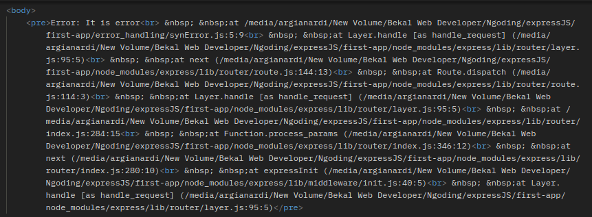

# Error Handling

Error handling adalah proses di mana menangkap dan memproses error yang terjadi secara synchronous dan asynchronous.

## Synchronous

Dalam synchronous kita hanya perlu memberikan task `throw new Error('error_message')` dan express secara default akan menampilkan secara lengkap dan tentunya tampak sangat rumit. Berikut contohnya:

```
const express = require("express");
const app = express();

app.get("/error", (req, res) => {
  throw new Error("It is error");
});

app.listen(4001, () => {
  console.log("Server 4001 is running...");
});
```

Sehingga saat kita melakukan request hasil errornya akan tampak seperti ini:

<p align="center">
 
</p>

## Asynchronous

Pada asynchronous ini hampir sama seperti synchronous, bedanya pada asynchronous ini kita menambahkan function next(). Dengan adanya function next ini akan secara otomatis membuat throw error juga tetapi errornya bisa kita handle atau olah saat error ini terjadi kita akan melakukan apa (biasanya memberikan status dan informasi error yang lebih jelas dan spesifik). Biasanya error dimasukkan ke <i>catch</i> selanjutnya akan dimasukkan lagi ke <i>next()</i>, agar nantinya bisa dihandle.

Kita bisa membuat error handling menggunakan middleware dengan menambahkan argument error sehingga nantinya akan terdapat 4 argument, yaitu err,req, res dan next. Berikut contoh error handling menggunakan middleware untuk dua function request yait `app.get('/'.....` dan function request `app.get('/error....`

```
const express = require("express");
const app = express();

// Error handling1---------------------------------
const errorHandler = (error, req, res, next) => {
  res.status(212).send(error.message);
};

// Error handling2---------------------------------
const errorHandler2 = (error, req, res, next) => {
  res.status(210).send(error.message);
};

// request function1 --------------------------------
app.get("/", (req, res) => {
  throw new Error("It is error");
});
// call error handling 1----------------------------
app.use(errorHandler);

// request function2 --------------------------------
app.get("/error", (req, res, next) => {
  FileSystem.readFile("/file-does-not-exist", (err, data) => {
    if (err) {
      next(err);
    } else {
      res.send(data);
    }
  });
});
// call error handling 2----------------------------
app.use(errorHandler2);

app.listen(4001, () => {
  console.log("Server 4001 is running...");
});
```

Hasilnya saat kita melakukan request `http://localhost:4001/` di postman akan tampil
di body akan tampil pesan error <i>It is error</i> dan menampilkan status: 212. Dan saat kita melakaukan request `http://localhost:4001/error` akan tampil di body pesan error <i>FileSystem is not defined</i> dan menampilkan status:210.

Urutan penulisan code sangat penting disini, dekalarasi function error handling bisa dibuat di paling atas kemudian baru dilanjutkan dengan request function terakhir baru kita buat code untuk memanggil function error handling. Urutannya persis seperti contoh code diatas.

Agar lebih paham kita bahas contoh lainnya.
Buat code dibawah ini dan lakukan request berdasarkan url dibawah ini, Maka hasilnya akan error dengan message user is not defined [[1]](https://www.youtube.com/watch?v=mGPj-pCGS2c).

```
const express = require("express");
const app = express();

app.get("/test", async (req, res) => {
  const name = user.name;
  return res.status(200).json({ succes: true });
});

app.listen(4000, () => {
  console.log(`Server 4000 is runing...`);
});
```

Kemudian jika kita mengubah code diatas dengan logika if seperti ini:

```
const express = require("express");
const app = express();

const getUser = () => undefined;

app.get("/test", async (req, res) => {
  const user = getUser();
  if (!user) {
    throw new Error("User not found");
  }
  return res.status(200).json({ succes: true });
});

app.listen(4000, () => {
  console.log(`Server 4000 is runing...`);
});
```

Hasilnya masih tetap error tetapi message errornya sesuai dengan yang kita buat yaitu User is not found. Kita bisa menghandle error (menambahkan task tertentu saat terjadi error) dengan cara menambahkan try catch block pada code diatas:

```
const express = require("express");
const app = express();

const getUser = () => undefined;

app.get("/test", async (req, res) => {
  try {
    const user = getUser();

    if (!user) {
      throw new Error("User not found");
    }
  } catch (error) {
    console.log(error);
    return res.status(400).send(error.message);
  }
  return res.status(200).json({ succes: true });
});

app.listen(4000, () => {
  console.log(`Server 4000 is runing...`);
});
```

Dengan menambahkan try catch block diatas kita bisa menghandle error, yaitu saat terjadi error kita akan menjalankan task console.log(error) dan pada saat kita mencoba melakukan request di postman akan muncul status 400 dan message error yang kita buat(User not found).

## Error Handling dengan Middleware

Kita juga bisa membuat error handling menggunakan middleware. Di contoh ini kita gunakan middleware untuk error handling secara modular dan satu lagi middleware di code utama [[1]](https://www.youtube.com/watch?v=mGPj-pCGS2c).

Pertama kita buat error handling middleware yang di jadikan modular (di contoh filenya bernama errorHandler.js):

```
const errorHandler = (error, req, res, next) => {
  return res.status(400).send(error.message);
};

module.exports = errorHandler;
```

Fungsi dari middleware di atas (errorHandler) untuk menampilkan status 400 dan menampilkan error message dari middleware di code utama saat user melakukan request di code utama tersebut. Selanjutnya kita buat middleware untuk code utama (di contoh filenya bernama errorHandlingEx2.js):

```
const express = require("express");
const errorHandler = require("./middleware/errorHandler");
const app = express();

const getUser = () => undefined;

app.get("/test", async (req, res, next) => {
  try {
    const user = getUser();

    if (!user) {
      throw new Error("User not found");
    }
  } catch (error) {
    return next(error);
  }
  return res.status(200).json({ succes: true });
});

app.use(errorHandler);

app.listen(4000, () => {
  console.log(`Server 4000 is runing...`);
});
```

Fungsi dari middleware di code utama ini adalah sebagai trigger untuk menjalankan middleware modular yang kita buat tadi (errorHandler) untuk menampilkan response 400 dan error message. Dimana trigger tersebut dilakukan melalui method next yang di jalankan di block catch:

```
  } catch (error) {
    return next(error);
  }
```

Artinya saat terjadi error jalankan middleware selanjutnya, yaitu middleware modular tadi (errorHandler) yang dipanggil melaui app `app.use(errorHandler);` untuk menampilkan status 400 dan error message.

## References

- [youtube.com/@onelightwebdev](https://www.youtube.com/watch?v=mGPj-pCGS2c)
