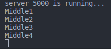
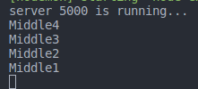

# Middleware

Fungsi middleware adalah fungsi yang memiliki akses ke request object (req), response object (res) dan next function dalam siklus request-response aplikasi.
next function adalah fungsi di router Express yang ketika dipanggil, mengeksekusi middleware selanjutnya untuk menggantikan middleware yang saat sedang dijalankan [[1]](http://expressjs.com/en/guide/writing-middleware.html).

Fungsi middleware dapat melakukan tugas-tugas berikut [[1]](http://expressjs.com/en/guide/writing-middleware.html):

- Menjalankan kode apa pun.
- Merubah object request dan response.
- Mengakhiri siklus request-response.
- Menjalankan middleware next untuk melanjutkan ke proses berikutnya.

Jika fungsi middleware saat ini tidak mengakhiri siklus request-response, ia harus memanggil next() untuk meneruskan kontrol ke fungsi middleware berikutnya. Jika tidak, permintaan akan menggantung [[1]](http://expressjs.com/en/guide/writing-middleware.html). Berikut menunjukkan elemen - elemen pemanggilan fungsi middleware [[1]](http://expressjs.com/en/guide/writing-middleware.html): <br>


```
const express = require("express");
const port = 5000;
const app = express();

// --------------------Deklarasi function Midleware ------------
const middle1 = (req, res, next) => {
  console.log("Middle1");
  next();
};

const middle2 = (req, res, next) => {
  console.log("Middle2");
  next();
};

const middle3 = (req, res, next) => {
  console.log("Middle3");
  next();
};

const middle4 = (req, res, next) => {
  console.log("Middle4");
  next();
};

// -------------------- Memanggil function Midleware ------------
app.use(middle1);
app.use(middle2);
app.use(middle3);
app.use(middle4);

// -------------------- Request  ------------
app.get("/", (req, res) => {
  res.send("Hello world! Welcome to the Express Js");
});

app.listen(port, () => {
  console.log(`server ${port} is running...`);
});

```

Pada contoh diatas kita membuat 4 function middleware, pertama kita harus mendaklarasikan function middleware yang kita buat (di contoh middle1, middle2, middle3 dan middle4).

Dibagian selanjutnya adalah bagian untuk memanggil function middleware. Untuk menjalankan fungsi middleware, harus dipanggil dengan format code

```
app.use(nama_function_middleware)
```

Kemudian terdapat bagian untuk membuat task request, yang mana perintah yang ada di dalam function middleware akan dijalankan ketika proses request dilakukan (browser direload). Sehingga hasilnya seperti ini: <br>

<p align='center'>

<p>

Perlu diperhatikan bahwa middleware ini bersifat syncronous sehingga urutan penulisan code saat penting, jika kita ubah urutan pengammilan function middleware seperti ini:

```
app.use(middle4);
app.use(middle3);
app.use(middle2);
app.use(middle1);
```

Hasilnya akan berubah urutan sesuai urutan penulisannya di code seperti ini:

<p align='center'>

<p>

Declarasi function request juga harus dibuat di bawah function middleware. Jika function request berada di atas function middleware maka function middleware tidak akan dieksekusi.

Untuk memahami middleware kita akan bahas 3 contoh perikut [[1]](http://expressjs.com/en/guide/writing-middleware.html):

- ### Middleware function myLogger

Ini adalah contoh sederhana dari fungsi middleware bernama "myLogger". Fungsi ini hanya mencetak "LOGGED" saat request ke aplikasi melewatinya. Fungsi middleware dideklarasikan ke variabel bernama myLogger.

```
const express = require("express");
const app = express();

const port = 3003;

//------------------------------------------

const myLogger = function (req, res, next) {
console.log("Logged");
next();
};

//------------------------------------------

app.listen(port, function () {
console.log(`server ${port} is okay`);
});

```

Untuk menjalankan fungsi middleware, harus dipanggil dengan format code `app.use(nama_function_middleware)`.Sehingga codenya menjadi seperti ini:

```

const express = require("express");
const app = express();

const port = 3003;

const myLogger = function (req, res, next) {
console.log("Logged");
next();
};

//------------------------------------------
app.use(myLogger);
//------------------------------------------

app.listen(port, function () {
console.log(`server ${port} is okay`);
});

```

Setelah function middleware dipanggil baru kita masukkan request/task berikutnya. Misalnya,request/task route ke root path (/).

```

const express = require("express");
const app = express();

const port = 3003;

const myLogger = function (req, res, next) {
console.log("Logged");
next();
};

app.use(myLogger);

//------------------------------------------

app.get("/", (req, res) => {
res.send("Hallo World");
console.log("hello");
});

//------------------------------------------

app.listen(port, function () {
console.log(`server ${port} is okay`);
});

```

Setiap kali app menerima request, perintah `console.log("Logged")` dan `console.log('hello')` akan dijalankan. Simpelnya setiap kali port/browser direload maka perintah dalam function middleware (perintah `console.log('Logged')`) dijalankan.

Urutan pemuatan middleware penting: fungsi middleware yang dimuat pertama juga akan dijalankan terlebih dahulu.

Jika function middleware myLogger dibuat setelah task route ke root path (/) (`function app.get("/"......`), permintaan tidak akan pernah mencapainya dan app tidak akan mencetak "LOGGED", karena penangan rute dari jalur root menghentikan siklus permintaan-respons.

- ### Middleware function requestTime

Selanjutnya, kita akan membuat fungsi middleware bernama "requestTime" dan menambahkan properti requestTime ke objek request.

```
express = require("express");
const app = express();

const port = 3003;

// ------------------ middleware function ------------------
const requestTime = function (req, res, next) {
req.requestTime = new Date();
next();
};

// ------------------ Call middleware function ------------------
app.use(requestTime);

app.get("/", function (req, res) {
let responseText = "Hello world <br>";
responseText += `<small>Request at: ${req.requestTime}</small>`;
res.send(responseText);
});

app.listen(port, () => {
console.log(`Server ${port} is okay`);
});
```

Setiap kali kita melakukan request ke root app (browser direload), aplikasi akan menampilkan nilai timestap secara real time di browser.

- ### Middleware function validateCookies

Terakhir, kami akan membuat fungsi middleware yang memvalidasi cookies yang masuk dan mengirimkan respons 400 jika cookie tidak valid. Berikut adalah contoh fungsi yang memvalidasi cookie dengan external async service [[1]](http://expressjs.com/en/guide/writing-middleware.html).

- ### Setting Keys untuk Headers

Disini kita akan membuat condisi request akan error 400 jika saat request tidak menyertakan content-type : application/json.

```
const express = require("express");
const app = express();

const requiereJsonContent = () => {
  return (req, res, next) => {
    if (req.headers["content-type"] !== "application/json") {
      res.status(400).send("server required application/jason");
    } else {
      next();
    }
  };
};

app.post("/", requiereJsonContent(), (req, res, next) => {
  res.send("You sent JSON");
});

app.listen(5000, () => {
  console.log("server is runing...");
});
```

Sehingga jika kita coba request post menggunakan postman dan set content-type: application/json dibagian headers, akan menghasilkan respon 200 dan sesuai code diatas menampilkan:

```
You sent JSON
```

Tetapik jika kita tidak set headers dengan content-type: aplication/json akan menghasilkan respon 400 dan sesuai code diatas menampilkan:

```
server required application/jason
```

## Reference

- [[1] expressjs.com](http://expressjs.com/en/guide/writing-middleware.html)

[[1]](http://expressjs.com/en/guide/writing-middleware.html)
